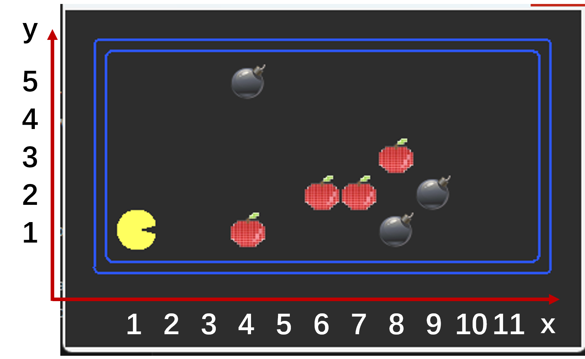
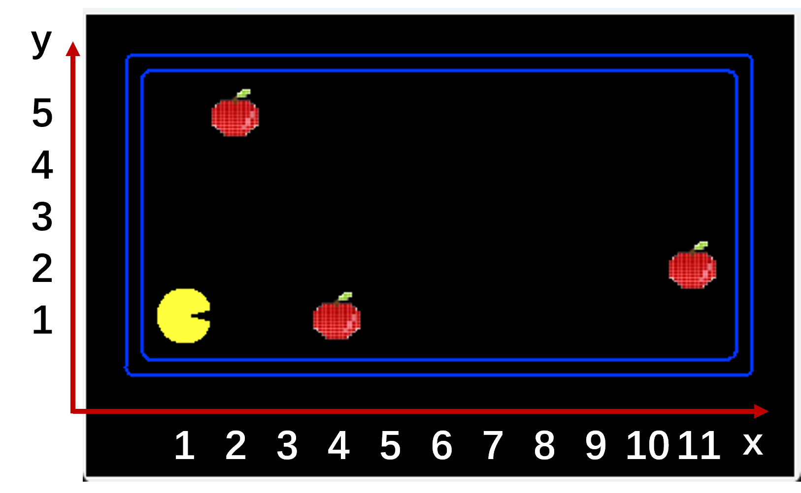
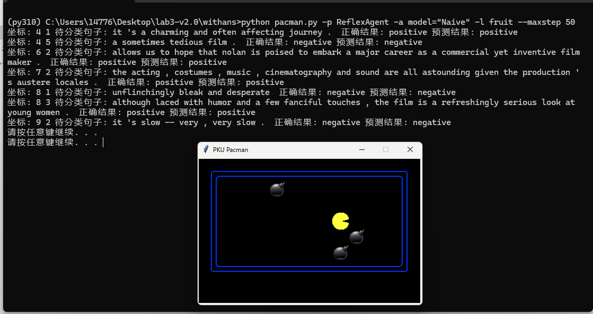
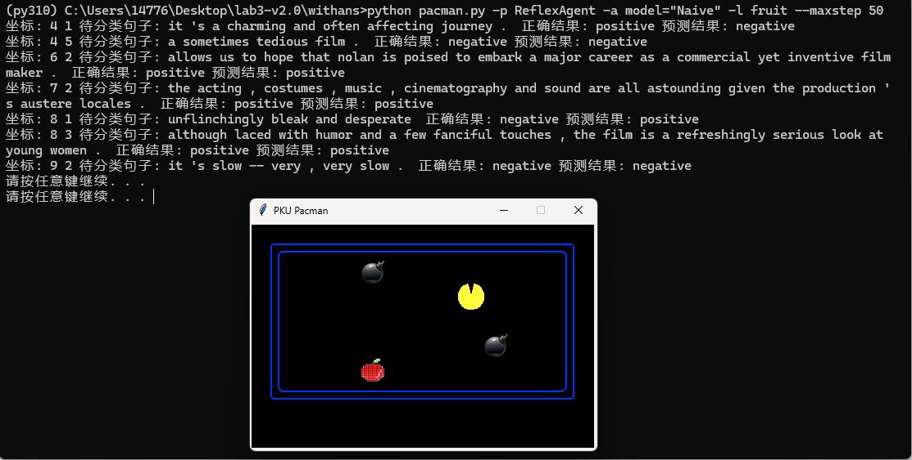
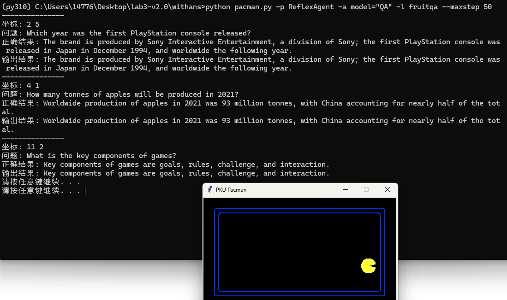
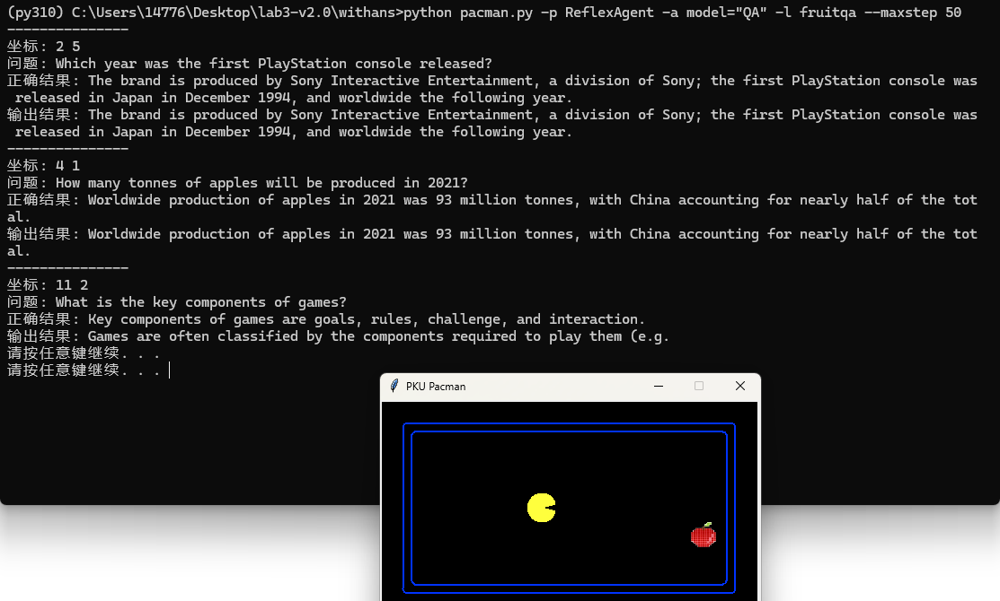

# Lab 3

### 目录

*   [介绍](#介绍)
*   [Q1: 朴素贝叶斯](#Q1)
*   [Q2: 神经网络情感分类](#Q2)
*   [Q3: QA](#Q3)


### 介绍
在这个项目中，你将使用numpy实现AI引论课上的学到的自然语言相关算法，通过判断句子正负情感或回答问题，让pacman具备基本的自然语言处理能力，并吃到所有正确的豆子。
本项目包括一个自动评分器，供你在机器上对答案进行评分。
用以下指令可以对所有题目进行评测。
`python autograder.py`
**lab3所需环境**
```
python=3.10.11
numpy
nltk
pillow
```
初次使用nltk时可能会提示缺少文件需要下载，请根据提示执行对应下载命令。如果网络问题无法下载，请手动将nltk_data.zip中数据放到指定位置。
**你需要修改的文件:**
* info.yaml 姓名学号
* FruitModel.py 模型代码
* BaseNode.py 与lab2类似
* BaseGraph.py 与lab2类似

**你需要阅读的文件:**
* SST_2/dataset.py 情感分类数据集接口
* fruit.py QA文档数据接口
* FruitModel.py 主函数模型训练部分

**需要修改并提交的文件:** 提交所有需要修改的文件以及训练好的模型。你可以使用以下指令来打包答案文件。
```
python compressAnswers.py
```

**评估:** 我们使用```autograder.py```对你的提交进行评分，但包含的测试用例与本地给出的样例文件有所不同。你可以在本地运行评分器对你的代码进行评测，但仅限于帮助调试代码，该分数不等于最终分数。

**学术诚信:** 我们会将你的代码与课堂上其他提交的代码进行逻辑查重。如果你拷贝了别人的代码，并做一些微小的修改，我们会很容易发现，请不要尝试。我们相信你们会独立完成作业。

### 数据说明

q1、q2使用SST数据集，包含训练集与测试集，以及一个很小的训练集合用以调试代码。请注意，代码评测时会换用另外的测试数据。你可以使用以下代码遍历所有训练数据或测试数据。
```
from SST_2.dataset import traindataset, minitraindataset
dataset = minitraindataset() # minitraindataset用来调试
dataset = traindataset() # 请提交使用traindataset的作业
for text, label in dataset:
	your code
```
其中text是由若干个单词形式token组成的List，label表示对应句子为正样本（1）或负样本（0）。句子已经进行了停止词过滤，因此可以直接使用。

q3使用wiki上获得的若干个词条页面数据，你可以使用以下代码获得所有数据。
```
from fruit import get_document
document_list = get_document()
```
这段代码会返回一个由docment组成的List，docment结构如下
```
docment # Dict
	docment # List token化的文档
	sentences # List 包含文档中所有句子
		tokens # token化的句子
		sentence # 原始句子数据，用来作为q3结果返回	
```
具体格式见```fruit.py```中```get_document```函数

autograder.py可以自动评分。对于q1,q2,q3，评分基于训练的模型在验证集上的准确率。

q1,q2,q3的数据是固定的，但请不要使用公布的验证集子集进行训练。

### 新的pacman规则
与lab2不同，食物仅有两种类型，苹果与炸弹。其中，苹果具有正分数而炸弹对应负分数。pacman允许走有限步（但可以保证将所有食物吃掉）。移动不扣分，吃到食物加上相应的分数。你不需要自己写agent，只需要设计情感分类模型与QA模型让pacman能够识别正负样本与回答问题。

地图文件存放在layouts文件夹下，一个典型的地图文件如下
```
q1 & q2
13 7
classifier
%%%%%%%%%%%%%
%P  A   O   %
%     AA O  %
%       A   %
%           %
%   O       %
%%%%%%%%%%%%%
-10 10
0 1 2 3 4 5 6

q3
13 7
qa
%%%%%%%%%%%%%
%P  A       %
%           %
%       A   %
%           %
%   A       %
%%%%%%%%%%%%%
-10 10 10 10
How many tonnes of apples will be produced in 2021?@@@Worldwide production of apples in 2021 was 93 million tonnes, with China accounting for nearly half of the total.
What is the key components of games?@@@Key components of games are goals, rules, challenge, and interaction.
Which year was the first PlayStation console released?@@@The brand is produced by Sony Interactive Entertainment, a division of Sony; the first PlayStation console was released in Japan in December 1994, and worldwide the following year.
```
其中P代表Pacman的起始位置，%代表墙壁，A代表苹果（对应正样本句子），O代表炸弹（对应负样本句子），之后为每个食物对应分数以及测试使用的QA数据。q3中仅有苹果，你不需要考虑它的情感分类，只需要对提问进行回答。测试数据中均没有Ghost。

可视化坐标系为笛卡尔坐标系第一象限，即x轴从左到右递增，y轴从下到上递增。
上述验证数据对应可视化结果为




由于训练时间较长，界面渲染后会暂停行动，请按任意键以继续pacman。

### <a name="Q1"></a> Question 1 (6 points): 朴素贝叶斯

使用课上所学内容，实现一个朴素贝叶斯以实现情感分类，你需要修改```FruitModel.py```中```NaiveBayesModel```类中```count```与```__call__```函数的填写。由于训练数据比较大，遍历一遍所需的时间很长，在调试时可以使用minitraindataset作为训练集。

写完后运行
```
python pacman.py -p ReflexAgent -a model="Naive" -l fruit --maxstep 50
```
来查看你的模型在pacman中的运行效果。这个例子使用layouts/fruit.lay作为地图，尽管pacman不能够完全正确分类数据集中所有句子的情感，但在这个例子中，你的pacman应当能够吃掉所有苹果且避开所有炸弹。
以下是答案正确的例子

图中列出了pacman初始场景中所有苹果与炸弹对应的待分类句子。由于苹果与炸弹对应句子难以可视化在pacman窗口中，我们以坐标形式给出：

当pacman能够正确分类例子中所有句子时，结果应如下图所示：

以下是一个分类错误的例子：

运行
```
python autograder.py --q q1
```
来评分(0-100)。本题的满分线是valid acc = 0.75。

注意autograder可能会报错`python: command not found`，此时请修改autograder.py开头的PYTHON_PATH为你的python程序的绝对位置(Linux和苹果用户可以在shell中用`which python`, windows用户可以在powershell中用`gcm python`)

### <a name="Q2"></a> Question 2 (6 points): 神经网络情感分类
#### 这部分作业需参考lab2完成

q2中我们给出了经过word2vec后每一个token对应的特征向量。每个特征向量大小为100维。你需要利用这些向量将句子映射为一个二维向量（LxD），并利用Transformer对句子进行情感分类。

注意，可能有部分token不包含在word2vec映射中，你需要设计一个方法处理这种情况。网络训练代码见```FruitModel.py```主函数部分，同样的，你可以使用minitraindataset来调试模型。

需要修改的文件包括```FruitModel.py```中```Embedding```类，```BaseNode.py```中```LogSoftmax```、```ResLinear```、```Linear```、```Attention```类，以及```BaseGraph.py```中正向与反向过程。

在```FruitModel.py```的```buildGraph```函数中，我们给出了一个简单的Transformer模型，你可以直接使用该模型，也可以尝试修改模型以提高准确率。

写完后运行
```
python FruitModel.py
```
进行训练并保存模型。

最后运行
```
python pacman.py -p ReflexAgent -a model="Attn" -l fruit --maxstep 50
```
来查看你的模型在pacman中的运行效果。这个例子使用layouts/fruit.lay作为地图，尽管pacman不能够完全正确分类数据集中所有句子的情感，但在这个例子中，你的pacman应当能够吃掉所有苹果且避开所有炸弹。

pacman运行结果例子与q1相同

运行
```
python autograder.py --q q2
```
来评分。

本题的满分线是valid acc=0.75。
提交时，需要提交训练好的模型文件及相关代码。

### <a name="Q3"></a> Question 3 (8 points): QA

修改```FruitModel.py```中```QAModel```类，基于TF-IDF实现QA。具体而言，你需要从若干个文档中选出一个最有可能包含答案的文档，之后从这个文档中挑选一个最符合问题的答案。

运行
```
python pacman.py -p ReflexAgent -a model="QA" -l fruitqa --maxstep 50
```
来查看你的模型在pacman中的运行效果。这个例子使用layouts/fruitqa.lay作为地图。
初始状态为：

当pacman正确回答提问时，会吃掉对应问题的苹果。你的pacman应当能够吃掉地图中所有苹果，结果应如下所示（请忽略pacman最终位置）：

当pacman回答错误时，最终会留下对应的苹果，如下图所示：

运行
```
python autograder.py --q q3
```
来评分。

本题的满分线是valid acc=1.0

可以参考CS50中关于这部分的思路介绍
https://cs50.harvard.edu/ai/2020/projects/6/questions/ 或 https://cs50.harvard.edu/ai/2024/

同时你可以运行
```
python qa.py
```
并手动输入问题来实现多次QA对话，输入exit退出程序。


### Acknowledgement

Designed and implemented by Yitian Liu, Guo Pu, Yiming Zhao and Xu Liu. Thanks all professors and TAs of the 2024 Introduction to AI team for the valuable discussions. This project is partially based on Harvard CS50 and UC Berkeley CS188 course projects.
